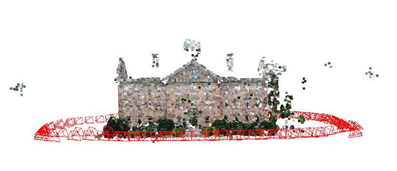
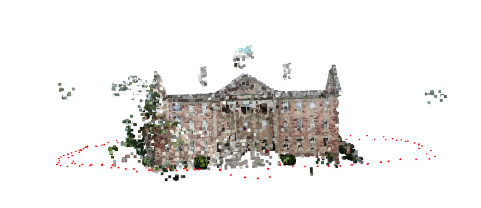
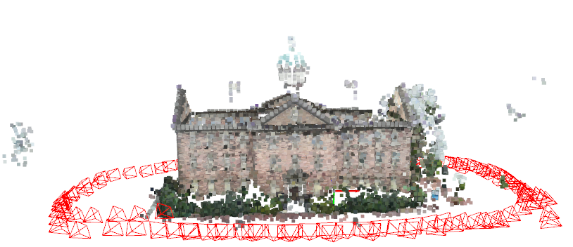

# Mappero 🚀

**Mappero** is a 3D capture, mapping, and reconstruction project that unifies various photogrammetry software and packages into a single toolset, simplifying 3D modeling, visual localization, and mapping workflows.

<table align="center">
  <tr>
    <td style="text-align: center;">
      
      <p><strong>Colmap</strong></p>
    </td>
    <td style="text-align: center;">
      
      <p><strong>Glomap</strong></p>
    </td>
    <td style="text-align: center;">
      
      <p><strong>OpenSFM</strong>: Superpoint Superglue 4096 .</p>
    </td>
  </tr>
</table>

## Table of Contents 📑

- [Support and Features](#support-and-features)
- [Installation](#installation)
- [Usage](#usage)
  - [Workspace](#workspace)
  - [Running Mappers](#running-mappers)
  - [Visualization](#visualization)
- [Running with Docker](#running-with-docker)

## Support and Features 🛠️

- **Support**: Integrates popular photogrammetry tools:
  - **COLMAP**: Structure-from-Motion and Multi-View Stereo
  - **GLomap**: Global Localization Mapping
  - **Pycolmap**: Python bindings for COLMAP
  - **OpenSfM**: Reconstruction using pycolmap and imm lib features and matchers
- 3D visualization based on **Open3D**

## Installation 🖥️

### Prerequisites

- Python 3.8+
- Git
- Docker (optional for containerized deployment)
- [COLMAP](https://github.com/colmap/colmap) 3.9.1
- [GLomap](https://github.com/colmap/glomap) 1.0.0
- [Pycolmap](https://github.com/colmap/pycolmap) 0.6.1
- [IMM](https://github.com/Tarekbouamer/imm/tree/dev) dev

Required Python packages (specified in `pyproject.toml`)

### Clone the Repository

1. Clone the repository:

   ```bash
   git clone https://github.com/Tarekbouamer/mappero.git
   cd mappero
   ```

2. Install dependencies:

   ```bash
   ./install_cmake.sh
   ./install_colmap.sh
   ./install_glomap.sh
   ./install_pycolmap.sh
   ```

3. Install Mappero:

   ```bash
   pip install --upgrade pip
   pip install -ve .
   ```

## Usage

### Workspace

Mappero follows Colmap's workspace structure for data organization, and some mappers requires Colmap's initial reconstruction as input.

```bash
south-building/
├── images/
├── colmap/ # or pycolmap/
│   ├── config.json
│   ├── images_paths.txt
│   ├── database.db
│   ├── sparse/0/
├── glomap/
│   ├── config.json
|   ├── database.db
|   ├── images_paths.txt
|   ├── sparse/0/
├── opensfm_xx/  # xx indicates the extractor and matcher used and their parameters
│   ├── config.yaml
│   ├── covisible_pairs.txt
│   ├── features.h5
│   ├── matches.h5
│   ├── database.db
│   ├── sparse/

```

### Running Mappers

To run the mappers, use the following commands:

```bash
# Colmap
mappero-colmap [OPTIONS] COMMAND [ARGS]...

Commands:
  fusion  Run the Fusion pipeline.
  mesh    Run the Meshing pipeline.
  mvs     Run the Multi-View Stereo (MVS) pipeline.
  sfm     Run the Structure-from-Motion (SfM) pipeline.
                                  
# Glomap
mappero-glomap [OPTIONS] WORKSPACE_PATH

# PyColmap
mappero-pycolmap [OPTIONS] COMMAND [ARGS]...

Commands:
  fusion  Run Fusion pipeline for creating the 3D model.
  mvs     Run Multi-View Stereo (MVS) pipeline.
  sfm     Run Structure-from-Motion (SfM) pipeline.
                                  

# OpenSfM
Usage: mappero-opensfm [OPTIONS] COMMAND [ARGS]...

Commands:
  sfm  OpenSfM pipeline to process images, extract features, match pairs,...
```

We use feature extractors and matchers from the `imm` library.

### Visualization

To visualize the results:

```bash
mappero-vis --model /path/to/data/south-building/sparse/0
```

## Running with Docker 🐳

### Build the Docker Image

```bash
# build the docker image
docker build -t mappero .
```

### Run the Docker Container

```bash
# run the docker container
# specify the path to the directory containing the images to be processed
docker run -it -v /path/to/your/data:/mnt/data mappero
```
